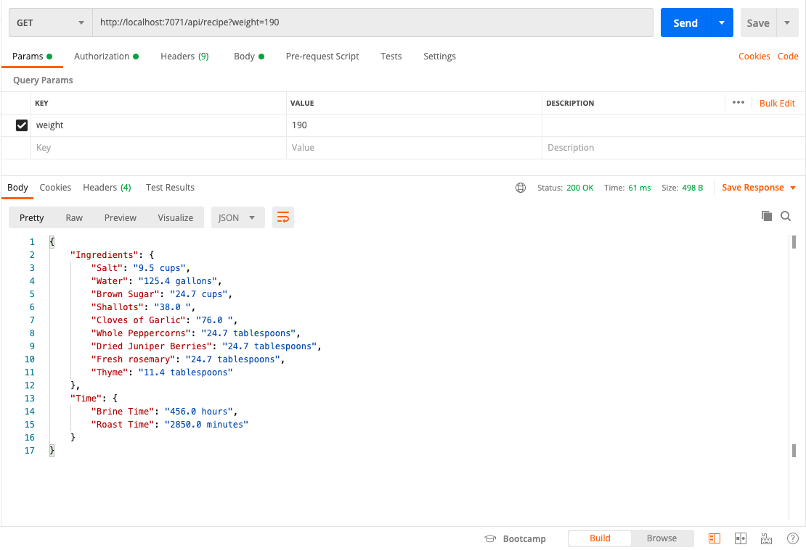

# The Perfect Holiday Turkey


## Challenge 1: The Perfect Holiday Turkey 🦃
Read the Challenge [here](https://github.com/microsoft/Seasons-of-Serverless/blob/main/Nov-23-2020.md)

## Solution
Solution creates a Serverless Endpoint using Azure Funtions using "Http Trigger" Template.
Language: python

# Running Serverless Endpoint
## Clone the repo
```bash
git clone git@github.com:ramanaditya/Seasons-of-Serverless-2020-Solutions.git

cd Seasons-of-Serverless-2020-Solutions/The-Perfect-Turkey
```

## Create the Virtual Environment
```bash
python -m venv venv
source venv/bin/activate
```

## Install Dependencies
```bash
python -m pip install -r requirements.txt
```

## Running Locally
```bash
func start
```

## Verify the API
#### BASE URL: [http://localhost:7071](http://localhost:7071)
#### API Endpoint: [api/recipe](http://localhost:7071/api/recipe)

- [Browser](http://localhost:7071/api/recipe)
- [Postman](https://www.postman.com/)

## Verify the API with [Postman](https://www.postman.com/)



## Verify the API with `curl`
```bash
curl -X GET http://localhost:7071/api/recipe?weight=190
```


## Verify the API with `http`
```bash
http GET http://localhost:7071/api/recipe?weight=190
```

